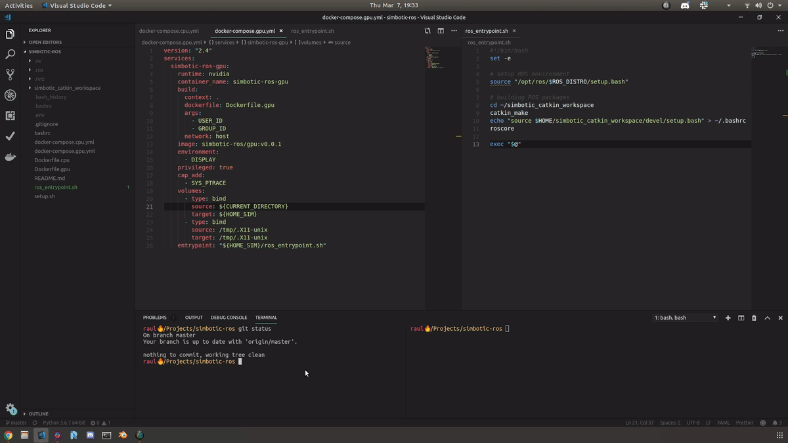

[](https://www.youtube.com/watch?v=E8aY146W6-U)

# Setup Instructions

## Install Docker, Docker Compose and nvidia-docker2
- https://docs.docker.com/compose/install/
- https://docs.docker.com/install/linux/docker-ce/ubuntu/
- https://github.com/NVIDIA/nvidia-docker

## Setup this repository
Clone repository:
```
git clone --recursive git@github.com:Simbotic/simbotic-ros.git
```
Create `.env` file:
```
./setup.sh
```
# Run GPU based container
```
docker-compose -f docker-compose.gpu.yml up
```
# Run CPU based container
```
docker-compose -f docker-compose.cpu.yml up
```
# Demos

## Zero-latency streaming
[](https://youtu.be/71B5teyduqU)

[](https://youtu.be/71B5teyduqU)

## ROS topics
[](https://youtu.be/7ecwkY0zGpE)

> Check [GScam docs](https://github.com/ros-drivers/gscam) to configure a camera feed or streaming.